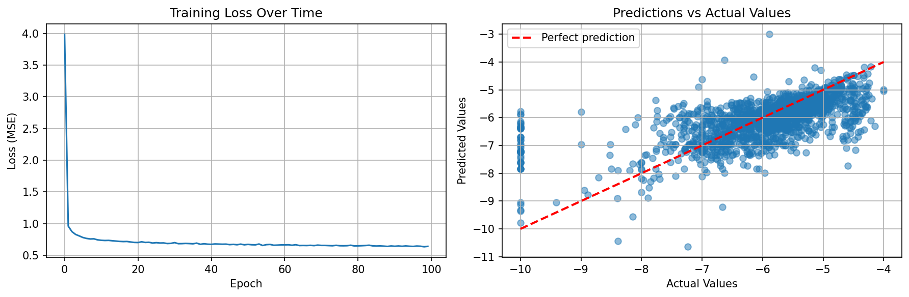

# Predicting Cyclic Peptide Membrane Permeability

Machine-learning models that predict the passive membrane permeability of cyclic peptides from their structure, trained on the 8,466 peptides in [CycPeptMPDB](http://cycpeptmpdb.com). Three approaches are compared on the same data:

1. **Classical ML on molecular features.** Seven regressors on 2D fingerprints (ECFP4), RDKit descriptors and 3D fingerprints (E3FP) of each peptide's conformers in water, chloroform and vacuum.
2. **A multilayer perceptron** on ECFP4, tuned with a Weights & Biases sweep.
3. **Residue-level graph neural networks.** Each peptide is modelled as a graph of its monomers; 17 PyTorch Geometric message-passing operators are compared in a staged W&B hyperparameter search.

**Stack:** Python, scikit-learn, XGBoost, LightGBM, PyTorch, PyTorch Geometric, RDKit, E3FP, Weights & Biases.

## Motivation

Cyclic peptides can bind protein surfaces that are hard to target with small molecules, but many cannot cross cell membranes. This limits their oral bioavailability and their use against intracellular targets. Predicting permeability from structure helps decide which candidates to synthesise. Permeable cyclic peptides are often *chameleonic*: they change conformation between water and the membrane interior. This project therefore also tests features built from each peptide's conformers in different solvents.

## Results

The target is log₁₀ P_app (cm/s). "CV" is the mean over shuffled 10-fold cross-validation; "hold-out" is a single random train/test split.

| Approach | Model | Features | Peptides | CV R² | Hold-out R² |
|---|---|---|---|---|---|
| Classical ML | **Random Forest** | ECFP4 counts + RDKit descriptors + E3FP solvent statistics¹ | 7,451 | **0.431** | — |
| Classical ML | LightGBM | ECFP4 counts + RDKit descriptors + E3FP solvent statistics¹ | 7,451 | 0.416 | — |
| Classical ML | LightGBM | ECFP4 + RDKit descriptors | 8,466 | 0.357 | 0.315 |
| Classical ML | LightGBM | ECFP4 counts | 8,466 | 0.353 | — |
| Classical ML | LightGBM | ECFP4 | 8,466 | 0.337 | 0.296 |
| Classical ML | LightGBM | E3FP (water + chloroform) | 7,451 | 0.218 | — |
| Deep learning | MLP, 1 hidden layer | ECFP4 | 8,466 | — | 0.313² |
| Deep learning | LEConv GNN | Residue graph, no ECFP fusion | 8,466 | — | 0.266³ |

¹ In the reported run, the solvent features were computed on `uint8` arrays, and an overflow in SciPy's `cosine` set the three chameleonicity scores to zero. This result therefore reflects the count fingerprints, descriptors and per-bit E3FP statistics. The code is now fixed, but this section has not been re-run (see section 7 of `01_classical_ml.ipynb`).
² 80/20 split with a different random seed from the classical models. ³ 70/30 split.

**Key findings**

- **3D solvent information complements 2D features.** The best model combines count fingerprints and descriptors with per-bit statistics of each peptide's E3FPs across water, chloroform and vacuum (CV R² 0.431 vs 0.337 for ECFP4 alone). 3D fingerprints on their own are weak (0.218). This comparison uses the 7,451 peptides with conformers and has not been ablated feature by feature.
- **Gradient boosting is the strongest model on 2D features.** LightGBM leads on every 2D feature set. Descriptors add a small, consistent gain, while recursive feature elimination (600 features) and PCA (62 components) did not improve on using all features.
- **Deep models did not beat the tree ensembles.** The MLP matches LightGBM on ECFP4, and the sweep preferred a 4-unit hidden layer. Residue-only GNNs reached R² 0.27. With about 8k noisy, partly censored labels, the input representation seems to matter more than model capacity.



*Training loss and hold-out predictions from an earlier MLP run. The vertical band at −10 is the floor value given to peptides below the assay's detection limit (see Limitations).*

## Approach

**Data.** CycPeptMPDB (Li et al., 2023) contains cyclic peptides from the literature with SMILES, monomer sequences, precomputed RDKit descriptors and a permeability label. Labels range from −10 to −3.9, with 273 peptides at the −10 floor. Lowest-energy conformers in water, chloroform and vacuum are available for IDs 1–7,451.

**Features**
- **ECFP4:** Morgan fingerprints (radius 2, 2,048 bits), as bits and as counts.
- **Descriptors:** 208 RDKit 2D descriptors plus two precomputed principal components.
- **E3FP** (Axen et al., 2017): 3D fingerprints of each solvent's conformer, folded to 2,048 bits. Across solvents they are summarised as per-bit mean and standard deviation, the chloroform–water bit difference, and pairwise cosine distances ("chameleonicity" scores).
- **Residue graphs:** one node per monomer, described by 122 standardised RDKit descriptors, with edges for backbone bonds and the cyclisation bond. ECFP4 can optionally be fused with the pooled graph embedding.

**Models**
- Linear Regression, Ridge, Lasso, k-nearest neighbours, Random Forest, XGBoost and LightGBM, all with library-default hyperparameters.
- A one-hidden-layer MLP in PyTorch.
- `PeptideGNN`: 1–3 PyTorch Geometric message-passing layers (17 operators, including GCN, GraphSAGE, GAT/GATv2, graph transformer, LEConv, ResGatedGraphConv, Chebyshev and ARMA filters), mean pooling and an MLP head.

**GNN hyperparameter search.** The W&B Bayesian sweeps ran in five stages, each narrowing the previous one (configs in [`sweep_configs/`](sweep_configs)):

1. Compare the 17 operators at a fixed width.
2. Search GNN and MLP-head depth and width for the shortlisted operators (LEConv, ResGatedGraphConv, MFConv).
3. Search optimiser (six options), learning rate, weight decay, batch size, epochs and activation for two architectures per operator.
4. Refine with dropout, early stopping and Kaiming initialisation.
5. Re-run the best configuration.

The run caps total about 1,400 runs.

## Limitations and next steps

- **Optimistic estimates.** 912 entries share their structure with another entry, so random splits can put the same peptide in both train and test. The W&B sweeps also select hyperparameters on the split they report. Scaffold- or cluster-based splits with a separate validation set (or nested CV) would give unbiased estimates.
- **Censored labels.** The 273 peptides at the −10 floor are treated as exact values. A censored-regression loss (e.g. Tobit) or a classify-then-regress model would handle them properly.
- **Best model.** It has no hold-out evaluation or per-feature ablation yet, and its chameleonicity scores were inactive in the reported run (footnote ¹).
- **Untuned baselines and single seeds.** The classical models use default hyperparameters, and the deep-learning results come from one random seed.
- **GNN representation.** Residue-level graphs discard atom-level structure. Atom-level graphs, or adding the solvent-dependent 3D features to the GNN, are natural next steps.

## Repository structure

```
├── notebooks/
│   ├── 01_classical_ml.ipynb       # fingerprints, descriptors, E3FP and 7 regressors (best model)
│   ├── 02_mlp.ipynb                # MLP baseline with a W&B sweep
│   └── 03_residue_gnn.ipynb        # residue-graph GNNs and the staged W&B search
├── sweep_configs/                  # W&B sweep definitions for the GNN search (stages 1–5)
├── scripts/
│   └── download_cycpeptmpdb_3d.py  # downloads the solvent-specific conformers
├── results/
│   ├── mlp_training_and_parity.png
│   └── gnn_sweep_gcn_vs_gat.csv    # W&B export of an early 1,000-run GCN vs GAT sweep
├── requirements-ml.txt             # notebook 01 and the download script
├── requirements-dl.txt             # notebooks 02 and 03
└── data/                           # not tracked; see "Getting started"
```

The notebooks are saved with the outputs of the original runs, so the results can be read without re-running anything.

## Getting started

**1. Environments.** Notebook 01 was developed with Python 3.13, and notebooks 02–03 with Python 3.10 in a separate environment.

```bash
conda create -n cycpep-ml python=3.13 -y && conda activate cycpep-ml
pip install -r requirements-ml.txt

conda create -n cycpep-dl python=3.10 -y && conda activate cycpep-dl
pip install -r requirements-dl.txt
wandb login
```

**2. Data.** The results use the CycPeptMPDB release dated July 2025 (8,466 peptides). The data are not redistributed here.

```bash
mkdir -p data
curl -o data/CycPeptMPDB_Peptide_All.csv "http://cycpeptmpdb.com/static//download/peptides/CycPeptMPDB_Peptide_All.csv"
curl -o data/CycPeptMPDB_Monomer_All.csv "http://cycpeptmpdb.com/static//download/monomers/CycPeptMPDB_Monomer_All.csv"
python scripts/download_cycpeptmpdb_3d.py   # ~22k conformer files; a few hours at one peptide per second
```

**3. Run.** Start Jupyter from `notebooks/`, since data paths are relative to that folder.

- **Notebook 01.** The first run spends 2–3 hours generating E3FP fingerprints, then caches them in `data/`.
- **Notebooks 02–03.** These log to the W&B project in `PROJECT_NAME`. Their final cells re-run the best configurations, and notebook 03 explains how to repeat the full staged search.


## Acknowledgements
This project was undertaken through the Denison Research Program at the University of Sydney, and would not have been possible without the guidance and support of Tommy Lu and Dr. Sameer Kulkarni.

## References

- Li, J. *et al.* CycPeptMPDB: A Comprehensive Database of Membrane Permeability of Cyclic Peptides. *J. Chem. Inf. Model.* **63**, 2240–2250 (2023). [doi:10.1021/acs.jcim.2c01573](https://doi.org/10.1021/acs.jcim.2c01573)
- Axen, S. D. *et al.* A Simple Representation of Three-Dimensional Molecular Structure. *J. Med. Chem.* **60**, 7393–7409 (2017). [doi:10.1021/acs.jmedchem.7b00696](https://doi.org/10.1021/acs.jmedchem.7b00696)
